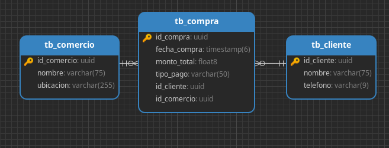

# SerfinsaPrueba.

DBMS: PostgreSQL

Cambiar los datos de conexion por la suya

## Diagrama entidad relación de base de datos

## Endpoint.
http://localhost:8080/api/cliente/insertar

http://localhost:8080/api/comercio/insertar

http://localhost:8080/api/compra/insertar

### Consulta compras realizadas en un comercio específico en base a la fecha y medio de pago.

http://localhost:8080/api/compra/consulta/a9b19864-c63f-4202-8365-87d672ad734e?fecha=2023-08-30&medioPago=Tarjeta

## Diagrama de Despliegue

|          Cliente         | Servidor Web |      Aplicación Spring      | Base de Datos |
|:------------------------:|:------------:|:---------------------------:|:-------------:|
| (Navegador,  App, Movil) |    Tomcat    | Boot API  (SerfinsaPuerba)  |   PostgreSQL  |
